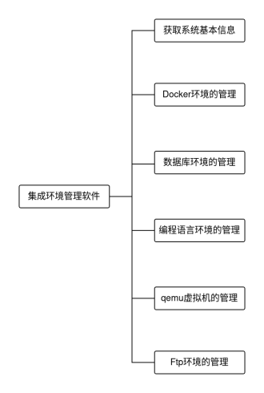
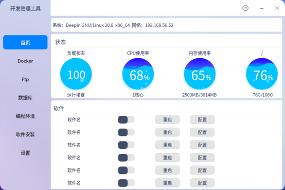
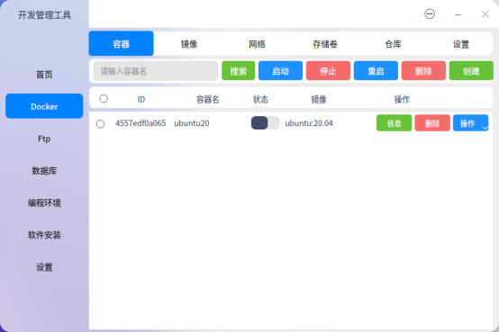
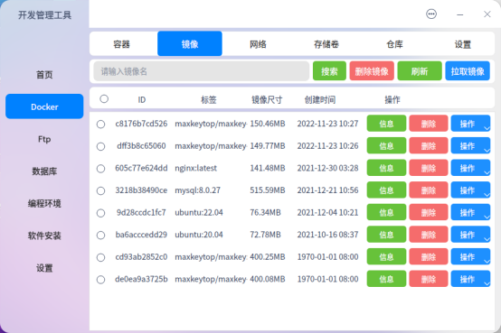
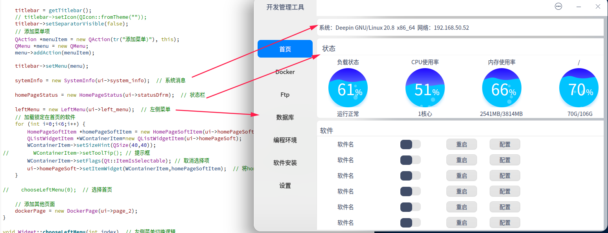
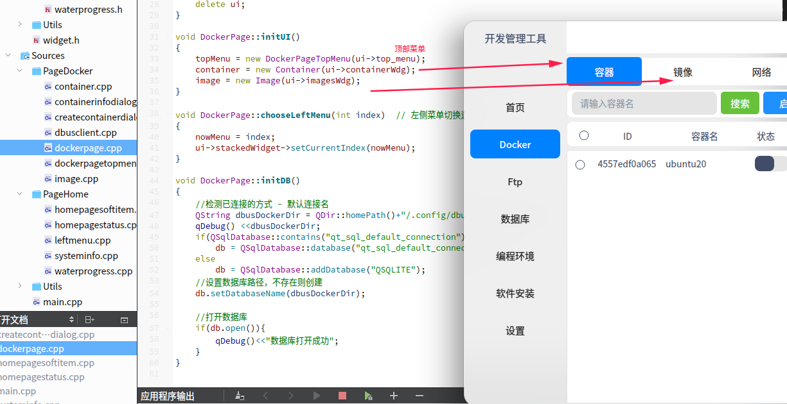

# **用途**

集成环境软件，将一些开发需要的运行环境进行集成进行可视化的管理。

# 开发背景

Linux入门也有较高的门槛，需要使用命令行，大部分使用者都是开发者，对于编程入门的用户往往都是选择Windows系统，但是在Windows下手工搭建各种开发环境都是一件比较麻烦的事情，而在Linux上可能仅需要一条指令的事情。

在国内的集成软件中有类似小皮面板、宝塔面板等软件，使用集成环理软件，可以完成自动下并载安装，图形化配置管理Web服务器，数据库服务等环境，这类软件主要针对Windows的客户端软件，在Linux上的软件是通过Web的方式进行管理，但是是面向服务器运维使用的，Linux的桌面用户没法更加便利的通过桌面客户端管理开发环境。

针对以上问题，开发集成环境软件，提高开发效率，更加便利的操作环境，提升开发体验，也希望更多的开发者也能选择Linux作为开发环境。

# 总体设计



# **功能介绍**

## 获取系统基本信息

获取系统的发行版，IP信息，硬件负载均衡，CPU使用率、内存使用率、磁盘使用率等信息并显示在界面上。

## Dcoker环境管理

对容器、镜像、网络信息、存储卷等提供可视化操作。

## 数据库环境管理

提供一些Mysql、Mongodb、Redis等数据库功能的管理等。

## 编程语言环境的管理

提供例如Python、Java等语言的多版本管理，或者包管理工具的可视化，直接通过调用命令行，必要数据存储到sqlite数据库中。

在Linux上，conda没有可视化的面板，通过可视化面板对conda进行简单的配置。

一些其他编程语言提供一键的安装配置（是否需要多版本共存，或者选择安装时选择其中一个版本进行安装）。

## qemu虚拟机的管理

qemu虚拟机的进行可视化的配置。

## Ftp环境的管理

在自己的电脑上搭建Ftp服务，在局域网中使用。

# 界面设计

## 首页



## Docker





# 如何开始

## 什么是DTK

[DTK（developer toolkit）开发者工具套件](https://wiki.deepin.org/zh/01_deepin%E9%85%8D%E5%A5%97%E7%94%9F%E6%80%81/01_deepin%E5%85%A5%E9%97%A8/02_%E5%BC%80%E5%8F%91%E7%9B%B8%E5%85%B3/new-page)

## 安装开发环境

```
# 更改源以获取 DTK 源码、相关依赖软件
sudo sed -i "s%#deb-src%deb-src%g" /etc/apt/sources.list
sudo apt update -y
# 安装qt开发环境
sudo apt install -y qtcreator qt5-default qtdeclarative5-dev build-essential g++ cmake qttools5-dev
# 安装dtk开发环境
sudo apt install -y deepin-sdk qtcreator-template-dtk
```

deepin-sdk包含：dtkcore、dtkgui、dktwidget

DTK的介绍可以查看下面链接

## 源码编译

[DTK安装与编译](https://wiki.deepin.org/zh/01_deepin%E9%85%8D%E5%A5%97%E7%94%9F%E6%80%81/02_deepin%E6%B7%B1%E5%85%A5/01_DTK%E7%9B%B8%E5%85%B3/DTK)

## 脚本

```bash
#!/bin/sh
# DTK主要就是下面几个库

DTK_LIST="dtkcore dtkgui dtkwidget"
QT5INTEGRATION="qt5integration"  # 因为qt5integration是qmake编译的单独写一个
# 1.更改源以获取 DTK 源码、相关依赖软件
sudo sed -i "s%#deb-src%deb-src%g" /etc/apt/sources.list 
sudo apt update
# 2.安装 git、Qt、编译工具集
sudo apt -y install git qtcreator qt5-default qtdeclarative5-dev g++ cmake qttools5-dev build-essential
# 安装dtk模板（qtcreator新建项目的dtk模板）
sudo apt install -y qtcreator-template-dtk
# 3. 安装 DTK 编译环境
sudo apt -y build-dep $DTK_LIST
# 4.在桌面创建目录存放源码
WORK_SPACE=~/Desktop/DTK_SRC && mkdir -p $WORK_SPACE && cd $WORK_SPACE
# 5.下载代码
apt source $DTK_LIST
# 6.建立 build 目录并编译、安装
SRC_LIST=$(find . -maxdepth 1 -mindepth 1 -type d) 
for proj in $SRC_LIST; 
    do 
        mkdir -p $proj/build && cd $proj/build; 
        cmake .. && make -j2 && sudo make install && cd $WORK_SPACE; 
    done;
# 7.创建目录存放qt5integration源码
QT5INTEGRATION_WORK_SPACE=~/Desktop/QT5INTEGRATION_SRC && mkdir -p $QT5INTEGRATION_WORK_SPACE && cd $QT5INTEGRATION_WORK_SPACE
apt source $QT5INTEGRATION
# 8.建立 build 目录并编译、安装
QT5INTEGRATION_SRC=$(find . -maxdepth 1 -mindepth 1 -type d)
mkdir -p $QT5INTEGRATION_SRC/build && cd $QT5INTEGRATION_SRC/build
qmake .. && make -j2 && sudo make install
echo "======================编译完成========================"
```

## 目录结构

```bash
├── main.cpp       # 程序入口文件
├── manager.pro    # qmake工程描述文件
├── PageDocker     # 存放Docker页面相关的源码以及UI文件
├── PageHome       # 存放首页相关以及UI文件
├── resources.qrc  # 资源文件的描述
├── Utils          # 存放一些工具类
├── widget.cpp     # 主窗口的源码
└── widget.ui      # 主窗口UI文件
```

# 程序运行

界面的不同部分进行了一定成都封装，widget.cpp为主窗口，程序运行后，其他区域加载进来。



dockerpage.cpp为Docker页面的主要类，其余界面都封装后加入到该类中初始化UI。


